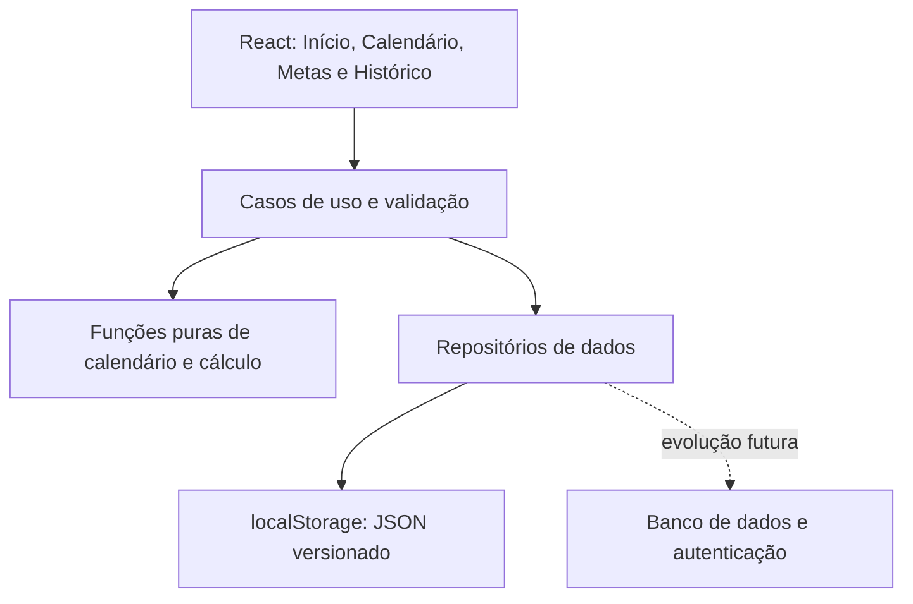

# Plano arquitetural — Controle de vendas e metas

Proposta de aplicativo React para uso pessoal, principalmente no celular. Documento de planejamento; não representa um aplicativo implementado.

## 1. Análise da planilha

Fonte: `metas Set.xlsx`, aba `Metas Set`. As datas em D11:D40 correspondem a setembro de 2026.

| Informação | Localização | Resultado |
| --- | --- | --- |
| Gatilho | E5 | R$ 51.765,00 |
| Acelera | E6 | R$ 64.655,00 |
| Incrível | E7 | R$ 72.405,00 |
| Vendas acumuladas | E11:E40, resumo I5 | R$ 29.691,56 |
| Escala | B11:D40 | 24 dias de trabalho e 6 folgas |
| Folgas | B11:D40 | 06, 07, 14, 20, 27 e 29/09 |
| Última venda positiva | D29:E29 | 19/09/2026 |

Em 20/09/2026, respeitando a escala registrada, restam oito dias de trabalho: 21, 22, 23, 24, 25, 26, 28 e 30. A soma dos valores diários foi conferida independentemente dos resultados salvos nas fórmulas.

| Meta | Falta vender | Necessário por dia restante |
| --- | --- | --- |
| Gatilho | R$ 22.073,44 | R$ 2.759,18 |
| Acelera | R$ 34.963,44 | R$ 4.370,43 |
| Incrível | R$ 42.713,44 | R$ 5.339,18 |

Pontos que o aplicativo precisa tratar:

- L5:L7 dividem as metas por 24, um número fixo. No aplicativo, a quantidade será derivada do calendário de cada mês.
- P6:P8 usam TODAY e contam dias sem folga até o fim do mês atual. Isso exige tratamento especial ao consultar meses anteriores e quando não restam dias de trabalho.
- I5 soma o intervalo inteiro, sem filtrar a data atual. O aplicativo impedirá vendas realizadas em datas futuras e delimitará o acumulado à data de referência.
- L11:N40 calculam venda menos média fixa; apesar do rótulo “Falta por Dia”, são diferenças assinadas em relação à média inicial. Inclusive exibem diferenças negativas nas folgas e em dias futuros com zero.
- Zero em dia futuro não prova ausência de vendas realizadas; é necessário distinguir “sem lançamento” de “dia encerrado com R$ 0,00”.
- Há horários de trabalho e uma coluna “Prod”, cuja definição não está documentada. Serão mantidos fora dos cálculos principais. Horários podem ser um campo informativo; “Prod” depende de esclarecimento antes de entrar no escopo.

## 2. Premissas da proposta

Decisões confirmadas: total diário editável e armazenamento em localStorage na primeira versão, sem conta. Uma possível versão futura poderá usar banco de dados, preservando o motor de cálculo.

- Um valor consolidado por data; ao atualizar, o novo total substitui o anterior.
- Três metas independentes por mês: Gatilho, Acelera e Incrível.
- Distribuição uniforme pelos dias de trabalho restantes, como na planilha. Horários diferentes não geram pesos automáticos.
- Sábados, domingos e feriados podem ser dias de trabalho. Somente a escala definida pela usuária determina as folgas.
- Moeda BRL, interface pt-BR e referência de data em America/Sao_Paulo.
- Cada novo mês possui suas próprias metas e escala. Copiar valores do mês anterior é uma ação explícita.

## 3. Experiência de uso

### Início

Abrir diretamente no mês atual, com seletor para consultar outros meses. Mostrar acumulado, dias de trabalho restantes e três cartões com valor da meta, progresso, saldo e média necessária por dia restante. A usuária pode destacar sua meta preferida sem ocultar as demais.

Exemplo com os dados analisados: “Para atingir Acelera, faltam R$ 34.963,44. Você precisa vender em média R$ 4.370,43 nos próximos 8 dias de trabalho. Hoje é folga.”

Ação principal: “Registrar total de hoje”. Exibir também “Editar outro dia” e “Encerrar dia”. O campo monetário usa teclado numérico, formatação brasileira e rótulo explícito “Total vendido nesta data”.

### Calendário

Visão mensal e alternativa em lista. Cada data indica trabalho ou folga, total registrado e situação do lançamento. Tocar no dia permite editar o total, definir folga/trabalho e encerrar ou reabrir o dia atual. Uma alteração de escala mostra imediatamente o efeito sobre as médias restantes.

Marcar uma data com venda como folga não apaga o valor: avisar que a venda continuará no acumulado. Alterações em datas passadas corrigem o histórico, mas não devolvem essas datas à contagem dos dias restantes.

### Metas do mês

Três campos editáveis em reais, com valores positivos e ordem Gatilho ≤ Acelera ≤ Incrível. Alterar uma meta recalcula o mês selecionado e registra o valor anterior no histórico de alterações. Não propagar a mudança para outros meses.

### Histórico

Lista dos meses, total vendido e metas atingidas. Meses encerrados mostram resultados finais, sem sugestões de venda para dias que já passaram. Permitir corrigir lançamentos antigos e exportar dados.

Priorizar texto legível, botões grandes, mensagens curtas e estados identificados por texto além de cor. Evitar tabelas largas como navegação principal no celular.

## 4. Regras de cálculo

Entradas: mês selecionado, data atual, escala, situação de hoje, metas e totais diários registrados.

Para cada meta M:

```text
A = soma dos totais registrados do mês até a data de referência
F = máximo(0, M - A)
D = quantidade de dias de trabalho ainda disponíveis no mês
P = A / M × 100

Se F = 0: meta atingida; necessidade diária = 0
Senão, se D > 0: necessidade diária em centavos = teto(F_em_centavos / D)
Senão: exibir saldo faltante e “Sem dias de trabalho restantes”
```

O arredondamento para cima evita que a recomendação fique alguns centavos abaixo do necessário. A barra visual pode parar em 100%, mas o percentual textual deve permitir valores superiores a 100%.

### Inclusão de hoje

- Hoje entra em D se for trabalho e estiver aberto, mesmo com um total parcial lançado.
- O total parcial entra em A imediatamente. Nesse caso, chamar o resultado de “Média adicional por dia restante, incluindo hoje”; não tratá-lo como o total que ela deveria vender hoje.
- Ao encerrar hoje, retirar hoje de D e recalcular para os próximos dias. Encerrar exige um total explícito, inclusive zero.
- Datas anteriores a hoje nunca entram em D, mesmo que tenham ficado sem encerramento.
- Folgas nunca entram em D. Vendas já registradas em folgas continuam em A.
- Ao virar o dia ou retornar ao aplicativo, atualizar a data e os resultados automaticamente.

### Períodos e lacunas

- Mês futuro: acumulado zero; considerar todos os dias de trabalho planejados; mostrar “Planejamento”.
- Mês passado: considerar todas as vendas daquele mês; D = 0; mostrar resultado final.
- Dia passado de trabalho sem total registrado: mostrar pendência. O acumulado usa apenas dados registrados, com aviso de que o cálculo está incompleto; não converter ausência em zero confirmado.
- Bloquear lançamento de venda em data futura. Calendário e metas futuras continuam editáveis.
- Meta ausente: solicitar configuração e não mostrar média como zero.
- Se uma folga futura substituir um dia de trabalho, D diminui e a necessidade diária aumenta automaticamente.

### Média inicial versus necessidade atual

“Média planejada do mês” = meta / total de dias de trabalho planejados. “Necessário a partir de agora” = saldo / dias restantes. A segunda informação deve ser o destaque. O MVP não terá comparação histórica de metas diárias dinâmicas: isso exigiria guardar a recomendação vigente em cada dia.

## 5. Arquitetura técnica

Proposta: React com TypeScript e Vite, interface responsiva e preparação para instalação como PWA. A documentação do React apresenta Vite como opção para montar uma aplicação do zero: https://react.dev/learn/build-a-react-app-from-scratch.

Persistência inicial: localStorage, encapsulado em um repositório. Componentes React não acessam diretamente o armazenamento. O repositório expõe operações assíncronas desde o início para permitir um adaptador remoto no futuro.



Responsabilidades:

- Apresentação: formulários, navegação, acessibilidade e estados de carregamento/erro.
- Aplicação: salvar total, alterar escala, encerrar dia, editar metas e carregar mês.
- Domínio: cálculos determinísticos sem dependência de React ou banco; data atual recebida como argumento para permitir testes.
- Dados: consultas, persistência, controle de versão e transformação dos registros.

Os totais acumulados e as médias são derivados; não são colunas persistidas que podem ficar desatualizadas. Usar estado local para formulários e uma camada compartilhada de carregamento do mês. Evitar uma biblioteca global de estado até surgir necessidade concreta.

Estrutura prevista:

```text
src/
  app/                 # inicialização e navegação
  features/
    dashboard/
    calendar/
    daily-sales/
    monthly-goals/
    history/
  domain/
    goal-calculator.ts
    calendar.ts
    money.ts
    types.ts
  data/
    month-repository.ts
    local-storage-repository.ts
    storage-migrations.ts
    backup.ts
  shared/ui/
```

## 6. Modelo de dados

| Entidade | Campos principais | Restrições |
| --- | --- | --- |
| monthly_plans | id, month, gatilho_cents, acelera_cents, incrivel_cents, version, created_at, updated_at | Um plano por mês; metas positivas e ordenadas |
| calendar_days | id, plan_id, date, is_workday, closed_at, shift_note, version | Uma data por plano; data dentro do mês |
| daily_totals | id, calendar_day_id, amount_cents, version, updated_at | Um total por data; valor ≥ 0 |
| goal_changes | id, plan_id, previous_values, new_values, changed_at | Histórico de alterações das metas |

Ausência de daily_totals significa “sem lançamento”; um registro com zero significa valor explicitamente informado. closed_at é relevante para distinguir o dia atual em andamento de encerrado, não para manter dias passados no denominador.

Essas entidades serão coleções dentro de um documento JSON, não tabelas de banco no MVP. Armazenar sob a chave `vendas_catita:data`, com envelope `{ schemaVersion, revision, updatedAt, monthlyPlans, calendarDays, dailyTotals, goalChanges }`. Validar o documento na leitura e aplicar migrações de formato quando necessário; uma falha de leitura nunca deve apagar os dados silenciosamente.

Dinheiro é armazenado como centavos inteiros, com validação de limites numéricos. Datas de negócio usam strings AAAA-MM-DD; instantes de edição usam strings ISO. Evitar interpretar uma data sem hora como meia-noite UTC e deslocá-la acidentalmente para o dia anterior.

Montar e validar o próximo estado antes de uma única chamada a `localStorage.setItem`. Tratar indisponibilidade e limite de espaço, preservando os dados digitados. Mostrar “Salvo neste aparelho” somente após sucesso. Usar uma única aba de edição como escopo inicial: observar o evento `storage`, atualizar a visualização e invalidar formulários antigos quando outra aba salvar. Uma checagem de revisão ajuda a detectar conflitos, mas não equivale a uma transação entre abas.

### Evolução para banco de dados

Um adaptador futuro pode usar Supabase Auth + PostgreSQL. Acrescentar user_id aos planos e políticas RLS que verifiquem a proprietária, inclusive nas entidades filhas. A combinação de autenticação e RLS é documentada em https://supabase.com/docs/guides/database/postgres/row-level-security. Manter credenciais administrativas fora do navegador.

Na migração: autenticar, validar dados locais, apresentar prévia, importar com IDs estáveis em transação e conferir totais. Preservar backup local até confirmar a transferência. Usar controle de versão no banco para edições concorrentes. Sincronização offline bidirecional é um projeto posterior, não consequência automática de trocar o adaptador.

## 7. Conexão e recuperação

O MVP grava localmente, sem depender de rede após o carregamento. Para abrir ou recarregar offline, será necessário cache dos arquivos da aplicação por service worker, a ser entregue junto da instalação como PWA. localStorage sozinho não torna a página disponível offline.

Os dados ficam vinculados ao navegador e à origem do site. Trocar de aparelho, limpar os dados do navegador ou mudar o endereço do aplicativo não transfere o histórico. Por isso, exportar e restaurar backup JSON fazem parte do MVP, com aviso simples “Dados salvos neste navegador” e data do último backup exportado.

O backup inclui versão do formato, metas, escala e totais. A importação valida formato, IDs, datas e valores, mostra uma prévia e pede confirmação antes de substituir os dados existentes. Oferecer exportação do estado atual antes da substituição. CSV pode ser uma exportação adicional para consulta; JSON é o formato de recuperação completa.

## 8. Aproveitamento da planilha

Uma migração inicial opcional lê somente datas, escala, metas e valores originais, recalculando os indicadores no aplicativo. Não importar resultados de fórmulas como fontes de verdade.

Para este arquivo: preencher setembro/2026 e as seis folgas identificadas. Vendas positivas até 19/09 são candidatas a importação. Zeros em datas futuras devem virar ausência de lançamento. Zeros em datas passadas de trabalho precisam de revisão, pois o arquivo não diferencia valor confirmado de preenchimento padrão. Apresentar a prévia e a reconciliação de R$ 29.691,56 antes de gravar. A migração deve impedir duplicação em uma segunda execução.

## 9. Etapas e critérios de aceite

1. Estruturar React + TypeScript + Vite e os tipos do domínio conforme as escolhas confirmadas.
2. Implementar o domínio e validar fórmulas com os dados da planilha, recebendo a data como parâmetro.
3. Implementar o repositório localStorage, validação, versão de formato e tratamento de erros.
4. Implementar Início, calendário, lançamento diário e edição de metas.
5. Adicionar histórico, exportação/restauração de backup e, se desejada, migração inicial da planilha.
6. Validar o uso no celular e publicar com recuperação de dados verificada.

Testes essenciais:

- Em 20/09/2026, os dados do arquivo retornam oito dias restantes e R$ 2.759,18 / R$ 4.370,43 / R$ 5.339,18 por dia.
- Editar uma venda passada atualiza acumulado e três saldos sem duplicar o lançamento.
- Adicionar/remover folga futura altera o divisor; alterar folga passada não cria disponibilidade futura.
- Encerrar hoje retira um dia do divisor; lançar valor parcial não encerra hoje automaticamente.
- Meta atingida retorna zero; saldo positivo sem dias restantes retorna estado explícito, sem divisão por zero.
- Mês passado, mês futuro, último dia, fevereiro bissexto e mudança de data respeitam o calendário.
- Ausência de lançamento e zero confirmado aparecem de maneira diferente.
- Troca de meta afeta somente o mês editado.
- Arredondamento não recomenda um total inferior ao saldo restante.
- Recarregar a página preserva dados; exportar e restaurar JSON reproduz metas, escala e totais.
- JSON inválido, versão incompatível ou falta de espaço não apagam o histórico nem exibem confirmação falsa.
- Alterações externas detectadas pelo evento storage invalidam formulários desatualizados.
- Após a instalação do cache PWA, a página abre offline e mantém os fluxos locais.

O primeiro lançamento estará pronto quando a usuária conseguir configurar um mês, registrar e corrigir totais, ajustar folgas e metas e entender quanto ainda precisa vender por dia para cada patamar.
